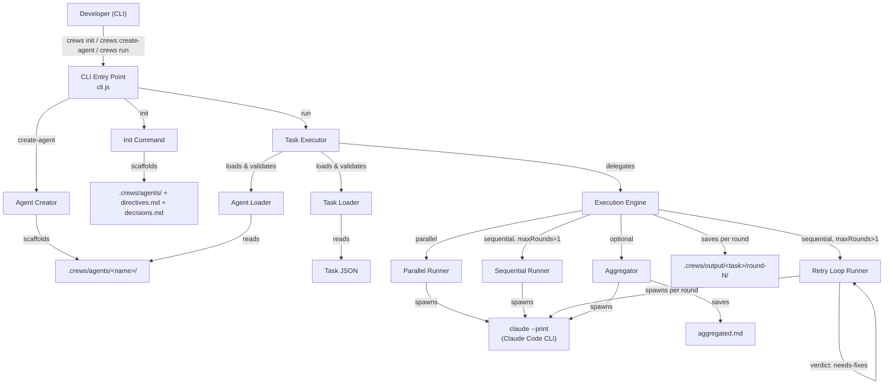
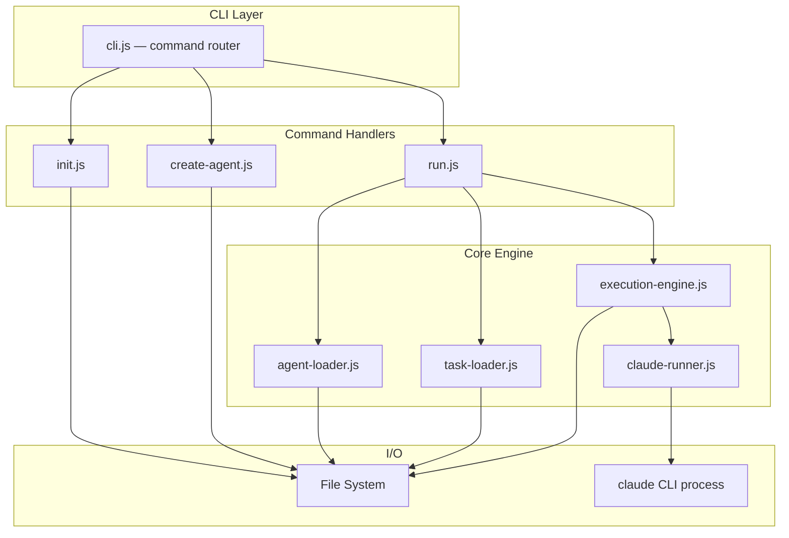
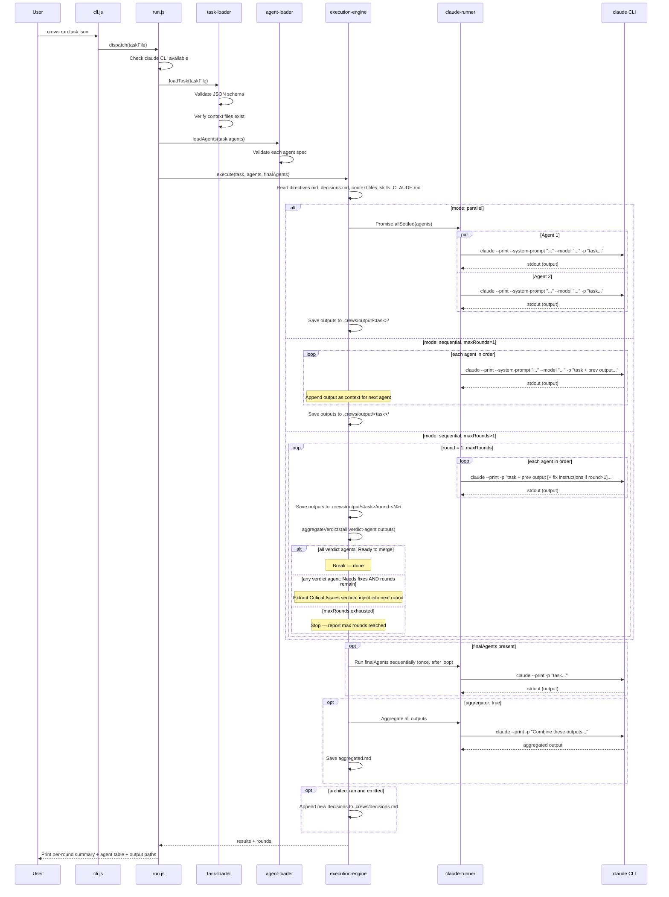
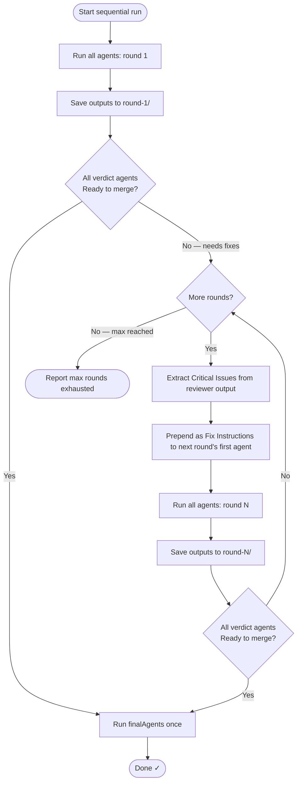

# Architecture: Crews CLI

## Overview

Crews is a lightweight, local-first multi-agent execution tool. It provides a CLI to define AI agent roles and run them via the **Claude Code CLI** (`claude --print`) in parallel, sequentially, or in a retry loop against any codebase.

The key difference from raw API calls: Claude Code CLI has full tool access — it can read files, write code, run commands, and navigate the project structure. Each agent runs as a separate `claude` process with its own system prompt and role, producing real, actionable output.

The system is intentionally minimal: a Node.js CLI with **zero external runtime dependencies**. The Claude Code CLI is a system-level prerequisite (like `git` or `node`), not an npm package.



### Key Design Decisions

1. **File-based configuration over database** — Agents and tasks are plain files, making them version-controllable and easy to inspect.
2. **ES modules throughout** — Aligns with the requirement for modern Node.js (18+) and `import/export` syntax.
3. **Zero runtime dependencies** — Uses only Node.js built-ins (`child_process`, `fs`, `path`). The Claude Code CLI is a system prerequisite, not an npm package.
4. **Claude Code CLI over raw API** — Agents get full tool access (file read/write, command execution) instead of text-only responses. Each agent runs as a `claude --print` process.
5. **Guard-clause error handling** — Validate early and throw descriptive errors before the happy path.
6. **Retry loop via verdict extraction** — Rather than a separate feedback protocol, the reviewer embeds a `Verdict:` line in its natural output. The engine scans for this line — no structured JSON or special API needed. Conservative default: if no verdict line is found, treat as "needs fixes".
7. **Shared context injection** — `directives.md` (permanent project rules) and `decisions.md` (accumulated architectural decisions) are injected into every agent automatically. The architect agent auto-appends its `## New Decisions` section to `decisions.md` after each run.
8. **Action agents receive file paths, not content** — In a retry loop, round 2's backend-dev needs to see what round 1 wrote to disk. Passing paths instead of embedded content ensures agents always work on the freshest state.
9. **Targeted fix injection** — To avoid bloating agent context across rounds, only the `## Critical Issues` section from the reviewer is passed forward, not the full history.

## Architecture

The system follows a layered architecture with clear separation of concerns:



### Directory Structure

```
crews/
├── cli.js                      # Entry point, command router
├── package.json                # Zero runtime deps, dev deps for testing only
├── src/
│   ├── commands/
│   │   ├── init.js             # Scaffolds .crews/ with all bundled agents
│   │   ├── create-agent.js     # Scaffolds a single new agent directory
│   │   └── run.js              # Loads task, orchestrates execution + summary
│   ├── core/
│   │   ├── agent-loader.js     # Loads & validates agent specs from .crews/agents/
│   │   ├── task-loader.js      # Loads & validates task JSON
│   │   ├── execution-engine.js # Parallel / sequential / retry orchestration
│   │   └── claude-runner.js    # Spawns claude CLI processes
│   └── utils/
│       ├── validation.js       # Name validation, schema checks
│       └── progress.js         # Console progress indicators
├── templates/
│   ├── init/
│   │   ├── directives.md       # Default project directives template
│   │   └── decisions.md        # Empty decisions log template
│   ├── agent/
│   │   ├── role.md             # Template for new agent role
│   │   ├── prompt.md           # Template for new agent prompt
│   │   └── config.json         # Template for new agent config
│   └── agents/                 # 10 bundled agents, copied by crews init
│       ├── backend-dev/
│       ├── code-reviewer/
│       ├── qa/
│       ├── architect/
│       ├── researcher/
│       ├── product-manager/
│       ├── dr-compliance/
│       ├── task-verifier/
│       ├── test-runner/
│       └── git-push/
└── examples/
    ├── sequential-implement.json
    ├── parallel-review.json
    └── retry-loop.json
```

## Execution Flow



## Retry Loop Flow



**Verdict agents** — the following agents emit a `Verdict:` line and gate the retry loop: `architect`, `dr-compliance`, `product-manager`, `code-reviewer`, `task-verifier`. **All** of them must say "Ready to merge" (or "Compliant") before the loop exits. One "Needs fixes" keeps it going.

**Fix instruction scoping** — only the `## Critical Issues` section from the reviewer is passed forward (not the full output). If no such section exists, the first 3000 characters are used. This keeps agent context tight across rounds.

## Components and Interfaces

### 1. CLI Entry Point (`cli.js`)

The entry point uses `process.argv` parsing (no external CLI framework) to route commands.

```javascript
const [command, ...args] = process.argv.slice(2);

switch (command) {
  case 'init':         await init();
  case 'create-agent': await createAgent(args[0]);
  case 'run':          await run(args[0]);
  default:             printUsage();
}
```

### 2. Agent Loader (`agent-loader.js`)

```typescript
interface AgentConfig {
  model: string;       // e.g. "claude-sonnet-4-6"
  type: string;        // "analysis" | "action"
  timeoutMs?: number;  // optional per-agent timeout
}

interface Agent {
  name: string;
  role: string;        // contents of role.md
  prompt: string;      // contents of prompt.md
  config: AgentConfig;
}

// loadAgent(name: string): Promise<Agent>
// - Reads .crews/agents/<name>/{role.md, prompt.md, config.json}
// - Validates all three files exist
// - Validates config.json schema
// - Throws descriptive error on any failure

// loadAgents(names: string[]): Promise<Agent[]>
// - Loads all agents, collects all errors, reports them together
```

### 3. Task Loader (`task-loader.js`)

```typescript
interface RetryConfig {
  maxRounds: number;      // positive integer, default 1 (no retry)
  reviewerAgent: string;  // agent whose output is used for fix instructions
}

interface Task {
  taskName: string;        // derived from filename, used for output dir
  description: string;
  agents: string[];
  mode: 'parallel' | 'sequential';
  context?: string[];      // file paths injected as context
  retry: RetryConfig;      // always present (defaults to maxRounds: 1)
  finalAgents?: string[];  // run once after the main loop
  aggregator?: boolean;
  skills?: string[];       // skill names from .claude/skills/<name>/SKILL.md
  claude_md?: string[];    // paths to CLAUDE.md-style context files
}

// loadTask(filePath: string): Promise<Task>
// - Reads and parses JSON
// - Validates required fields: description, agents, mode
// - Verifies all context file paths exist and are readable
// - Returns validated Task object with defaults applied
```

### 4. Execution Engine (`execution-engine.js`)

```typescript
interface AgentResult {
  agentName: string;
  output: string;
  durationMs: number;
  status: 'complete' | 'error';
  error?: string;
}

interface RoundResult {
  round: number;
  results: AgentResult[];
  verdict: 'ready' | 'needs-fixes';
}

// execute(task, agents, finalAgents): Promise<{ results, aggregated, outputDir, rounds }>
// - Reads directives.md, decisions.md, context files, skills, CLAUDE.md files
// - Dispatches to parallel, sequential, or retry runner
// - Runs finalAgents once after the main loop
// - Auto-appends architect's ## New Decisions to .crews/decisions.md
// - Runs aggregation if task.aggregator is true

// composeMessage(task, agent, contextContents, previousOutput, prevAgentName, skills, directives, decisions, claudeMdContents): string
// - Builds the full user message sent to each agent invocation
// - Action agents: context files passed as paths (read fresh from disk each round)
// - Analysis agents: context files embedded as full content

// extractVerdict(output): 'ready' | 'needs-fixes'
// - Scans for a line starting with "Verdict:"
// - "Ready to merge" or "Compliant" → 'ready'
// - Anything else, or no Verdict line found → 'needs-fixes' (conservative default)

// aggregateVerdicts(results, reviewerAgentName): 'ready' | 'needs-fixes'
// - Checks all known verdict agents in results
// - Returns 'ready' only if ALL of them pass
```

### 5. Claude Runner (`claude-runner.js`)

```typescript
// runAgent(options: {
//   name: string,
//   systemPrompt: string,   // from prompt.md
//   model: string,          // from config.json
//   type: 'analysis' | 'action',
//   userMessage: string,    // composed message
//   timeoutMs?: number      // from config.json
// }): Promise<{ output: string, exitCode: number, stderr: string }>

// CLI args built per agent type:
//
// Analysis agent (read-only):
//   claude --print --system-prompt "<prompt>" --model "<model>" --allowed-tools "Read,Grep,Glob" -p "<message>"
//
// Action agent (full access):
//   claude --print --system-prompt "<prompt>" --model "<model>" --permission-mode bypassPermissions -p "<message>"
//
// - Spawns via child_process.spawn with stdin: 'ignore' (prevents interactive mode hang)
// - Streams stdout/stderr, capped at 10MB each
// - Kills process with SIGTERM if timeoutMs is exceeded
// - CREWS_MOCK=true returns mock output without calling Claude (dry-run mode)
```

## Data Models

### Agent Files

**`.crews/agents/<name>/role.md`** — Free-form markdown describing the agent's role, expertise, and boundaries. Injected into every message.

**`.crews/agents/<name>/prompt.md`** — System prompt sent to Claude.

**`.crews/agents/<name>/config.json`**:
```json
{
  "model": "claude-sonnet-4-6",
  "type": "analysis",
  "timeoutMs": 120000
}
```

Agent types control tool access:
- `analysis` → `--allowed-tools "Read,Grep,Glob"` — read-only
- `action` → `--permission-mode bypassPermissions` — full tool access (read, write, bash)

### Task File

```json
{
  "taskName": "add-input-validation",
  "description": "Implement input validation for the /users endpoint",
  "agents": ["backend-dev", "qa", "code-reviewer"],
  "mode": "sequential",
  "context": ["src/routes/users.js", "test/routes/users.test.js"],
  "retry": {
    "maxRounds": 3,
    "reviewerAgent": "code-reviewer"
  },
  "finalAgents": ["git-push"],
  "aggregator": true,
  "skills": ["my-skill"],
  "claude_md": ["CLAUDE.md"]
}
```

### Composed Message Structure

```
## Task

<task.description>

## Your Role

<agent/role.md>

## Project Directives (always follow these)

<.crews/directives.md>

## Architectural Decisions (from previous crews runs)

<.crews/decisions.md>

## Skill: <name>                    ← if task.skills is set
<skill content>

## Service Context: CLAUDE.md       ← if task.claude_md is set
<CLAUDE.md content>

## Relevant Files                   ← action agents: paths only
- src/routes/users.js

## File: src/routes/users.js        ← analysis agents: full content
```<content>```

## Previous Agent Output: backend-dev   ← sequential mode only
<previous agent output>

## Fix Instructions (Round N review)    ← retry loop, round > 1
Fix only the issues listed below...
## Critical Issues
<extracted from reviewer output>
```

### Output Structure

Single-pass (no retry):
```
.crews/output/<taskName>/
├── backend-dev.md
├── qa.md
├── code-reviewer.md
└── aggregated.md         # only if aggregator: true
```

With retry loop (`maxRounds > 1`):
```
.crews/output/<taskName>/
├── round-1/
│   ├── backend-dev.md
│   ├── qa.md
│   └── code-reviewer.md
├── round-2/              # only if round 1 verdict was needs-fixes
│   ├── backend-dev.md
│   ├── qa.md
│   └── code-reviewer.md
└── git-push.md           # finalAgents always written to root output dir
```

## Error Handling

Following the guard-clause convention — validate early, throw descriptive errors, keep the happy path flat.

### CLI Layer

| Condition | Behavior |
|-----------|----------|
| Unknown command | Print usage, exit 1 |
| Missing required argument | Print command usage, exit 1 |
| `claude` CLI not found on PATH | Print installation instructions, exit 1 |
| Task file not found | Print error with file path, exit 1 |

### Validation Errors

| Condition | Behavior |
|-----------|----------|
| Agent spec missing files | Error identifies agent name + which file(s) missing |
| `config.json` malformed JSON | Error identifies agent name + parse error |
| `config.json` invalid schema | Error identifies agent name + which fields are invalid |
| Task JSON parse error | Error with file path + parse error |
| Task missing required fields | Error listing all missing/invalid fields |
| Task references non-existent agents | All missing agents collected, reported together |
| Task references non-existent context files | All missing paths collected, reported together |

### Execution Errors

| Condition | Behavior |
|-----------|----------|
| `claude` process exits non-zero | Mark agent as failed, include stderr in error report |
| Parallel mode: agent failure | Continue other agents, mark failed agent with error |
| Sequential mode: agent failure | Halt sequence, report which agent failed and why |
| Agent times out | Kill with SIGTERM, report timeout duration |
| Transient network/API error | Retry up to 2 times with exponential backoff (5s, 10s), then fail |

### Error Message Format

```
Error: <what went wrong>
  → <specific detail>
  → <specific detail>
```

Example:
```
Error: Failed to load 2 agent(s):
  → Agent "backend-dev": config.json has invalid fields
      → type must be "analysis" or "action"
  → Agent "qa": prompt.md not found
```
